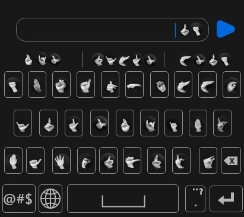
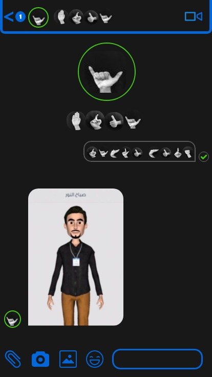

# Waseet-Messenger

## Waseet Messenger Chatting APP

Waseet Messenger is a chatting system like FB Messenger, Telegram or WhatsApp, designed to be used by deaf as the same as the not deaf people, so that there will not be any difference among them, everyone use his/her preferred language. 

**Waseet Designed To help those even of deaf and meet other problem like Reading Natrual Arabic Language via Simulation**

#### Designed Keyboard for deaf

#### Waseet AI Simulator for Arabic Sign Language

